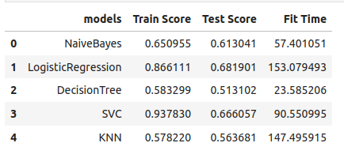

# Predict genre of book based on summary
The dataset under study contains information on 16K books. It is obtained from Carnegie Mellon University dataset originally and available in Kaggle (https://www.kaggle.com/datasets/ymaricar/cmu-book-summary-dataset). The goal of this project is to identify genre of book based on book's summary. 
Only the following genres have major representation in the dataset : fantasy,mystery,historical,romance,thriller,humor,horror,philosophy,crime. Also the project concerns itself only with fiction genres.

## 1. Business Goals

1. Predict genre of book based on book summary.
2. Analyse what features in the summary determine the genre if such unique features exist.
3. Report any limitations of findings

## 2. Data Understanding
Here we take an initial look at the given data and explore the quality of it.

### 2.1 Gather Data And Describe
The original dataset was not in csv format but in txt with non-standard markers. The first task was to extract the fields from the txt file and create dataframe as
below:


As you can see, `genre` is not a simple field. A book can belong to multiple sub-genres. Need to obtain the top genre it is listed under in goodreads.com. It is a two step process to obtain this information.(This work is done in 'GetBookId' notebook)
1. Obtain book id for each book from goodreads by searching the site via selenium 
2. Once book id is obtained, urllib library can be used to query for the meta data of the book and extract the top genre.
3. Along with extracting top genre, also classify books as fiction or non-fiction. This is later used to extract only fiction books for this project.

#### NOTE: Do not run GetBookId notebook as the pkl files are already saved.

Note: While extracting the top genre, only the following main genres are considered: 
```
['humor',
 'comedy',
 'horror',
 'fantasy',
 'historical',
 'romance',
 'thriller',
 'mystery',
 'crime',
 'science',
 'philosophy']
 ```

The final dataframe resulting from the above two steps is saved as pickle file which is then loaded in the main 'FinalBookGenrePred' notebook.

```
RangeIndex: 10366 entries, 0 to 10365
Data columns (total 8 columns):
 #   Column         Non-Null Count  Dtype 
---  ------         --------------  ----- 
 0   Title          10366 non-null  object
 1   BookId         10366 non-null  object
 2   Author         10366 non-null  object
 3   PublishedDate  7637 non-null   object
 4   Genre          8876 non-null   object
 5   Summary        10366 non-null  object
 6   NewGenre       7096 non-null   object
 7   Fiction        10366 non-null  int64 
dtypes: int64(1), object(7)
```


```
NewGenre
fantasy       2930
mystery       1154
historical     636
romance        545
thriller       491
humor          458
horror         398
philosophy     228
crime          133
science         78
roman           37
comedy           8
Name: count, dtype: int64

Fiction
1    6845
0     251
Name: count, dtype: int64
```
We can see that 'roman' genre was retained even though it was not in the main genres list. This is due to 'romance' containing substring 'roman' . We can remove some of the under represented genres. It is a unbalanced dataset.
This is a heavily unbalance dataset between fiction and non-fiction as well. We will not deal with this as we are only concerned with fiction genres.

Initial observations:
1. We have about 10K entries and 8 columns after data scraping and initial cleanup.
2. `PublishedData` and `Genre` have many NaN values
3. Almost all features are non-numeric as expected.
4. The dataset is heavily unbalanced

### 2.2 Early Data Exploration and Quality Check
In this section, we determine the following:
1. Are there duplicates in the data?
2. What columns have NaN values and how many?
3. Are there any structural issues with the data including typos and dtype?

#### Duplicates:
Check for duplicates returned the following:

Number of duplicates: 0

#### Null Values:

Null value check returned the following:

```
Title               0
BookId              0
Author              0
PublishedDate    2729
Genre            1490
Summary             0
NewGenre         3270
Fiction             0
dtype: int64
```
We are only concerned with the `NewGenre` column, so we need to remove null values from this only.


#### Structural Issues

The `Summary` column contains many stopwords and punctuation marks and these need to be removed.
```
' Old Major, the old boar on the Manor Farm, calls the animals on the farm for a meeting, where he compares the humans to parasites and teaches the animals a revolutionary song...'
```


## 3. Data Preparation And Further Understanding
In this section, we will act on the observation and decisions taken above.

1. Remove NaN
2. Remove under-represented genres
3. Fix `Summary` by removing punctualtion and stopwords
4. Make new feature column for `Summary` to include book title
5. Make new column `GenreNum` to store label encoded value of the `NewGenre` column
5. Extract named entities from summary and create new column for future use
6. Look at word clouds to see what are the common ones for a genre if any.
7. Split the dataset into train and test.

Note: To extract named entities need to keep summary text intact, hence no stemming or lemmatization is done in this initial analysis. A quick check was done as a trial and it did not result in
high performance.

#### Remove NaN
Removing NaN from `NewGenre` column
```
Index: 6845 entries, 0 to 10364
Data columns (total 8 columns):
 #   Column         Non-Null Count  Dtype 
---  ------         --------------  ----- 
 0   Title          6845 non-null   object
 1   BookId         6845 non-null   object
 2   Author         6845 non-null   object
 3   PublishedDate  5217 non-null   object
 4   Genre          6267 non-null   object
 5   Summary        6845 non-null   object
 6   NewGenre       6845 non-null   object
 7   Fiction        6845 non-null   int64 
 ```

#### Remove under-represented genres
Removing roman, comedy and science genres

```
NewGenre
fantasy       2930
mystery       1154
historical     621
romance        542
thriller       488
humor          431
horror         397
philosophy     121
crime          115
Name: count, dtype: int64
```

#### Structural Issues:

New column `CleanSummary` is created by combining `Title` and `Summary` and then removing stopwords and punctuation marks. `GenreNum` column is added with label encoded genre values.

#### Word Cloud Analysis:
Comparing two word clouds from 'fantasy' genre.


No obvious commonality seen between the two books to suggest similar genre. What we notice is named entities like 'Louisiana' and 'Napoleon' are very frequent.
These don't add value to the prediction. Will extract named entities and remove the PERSON entities from summary.

#### Extract Named Entities
Named entities are extracted for each book summary and stored as a column in the dataframe for future use. Also created a new column `CleanSummaryNoPerson` to remove all PERSON entities as they don't add value to prediction of genre.

```
Index: 6799 entries, 0 to 10364
Data columns (total 13 columns):
 #   Column                Non-Null Count  Dtype 
---  ------                --------------  ----- 
 0   Title                 6799 non-null   object
 1   BookId                6799 non-null   object
 2   Author                6799 non-null   object
 3   PublishedDate         5187 non-null   object
 4   Genre                 6241 non-null   object
 5   Summary               6799 non-null   object
 6   NewGenre              6799 non-null   object
 7   Fiction               6799 non-null   int64 
 8   GenreNum              6799 non-null   int64 
 9   CollectiveSummary     6799 non-null   object
 10  CleanSummary          6799 non-null   object
 11  named entities        6799 non-null   object
 12  CleanSummaryNoPerson  6799 non-null   object
dtypes: int64(2), object(11)
```
We will use `GenreNum` as target and either `CleanSummary` or `CleanSummaryNoPerson` as input.

#### Dataset split up
We will shuffle the dataframe first and then do a 75/25 train/test stratified split.

## 4.0 Modeling
The approach we will take to finding a good model is as follows:

1. Use TFIDF Vectorizer to convert text input to numeric.
2. Use `CleanSummary` as input to model with hyperparam tuning(GridSearch) using LogisticRegression, SVM, MultinomialNB and Decision Trees.
3. Repeat the above steps with `CleanSummaryNoPerson` as input.

#### Performance metrics
Metric used here is 'accuracy score'. Further analysis needed to see if a different metric is suitable.


## 5.0 Evaluation

### With Named Entity Intact:



DecisionTree seems to overfit on training set and perform quite poorly on test set. Logistic Regression and SVM seem to give reasonable peformance on test set.
Still, the disparity between train and test score is quite large.

### With PERSON named entity removed:


No major difference here. The training score is a bit closer to test score for LogisticRegression but SVM has similar scores.

## 6.0 Next Steps
We haven't yet found a good model that accurately predicts the genre of book. The machine learning methods used do not give a high performance.
Some next steps to further enhance the prediction are as follows:
1. Use ensemble techniques
2. Use deep learning techniques
3. Explore other metrics like confusion matrix along with above techniques.
4. Use lemmatization and stemming techniques to see if there is any benefit.


 


